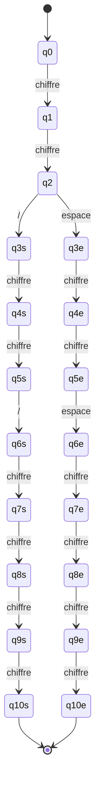

# Automate — DATE

Regex de départ (voir [`../regex.md`](../regex.md)) :

```
[0-9]{2} / [0-9]{2} / [0-9]{4}
[0-9]{2} " " [0-9]{2} " " [0-9]{4}
```

Point important qu'on avait mal compris au début en lisant vite le `.jj` : ce ne sont
**pas** deux séparateurs interchangeables à chaque position. Ce sont deux formats
complets et séparés — soit toute la date utilise `/`, soit toute la date utilise des
espaces. On ne peut pas écrire `15/06 2026` par exemple. L'automate doit donc bien
forker en deux branches indépendantes juste après le jour, et chaque branche doit
rester cohérente avec elle-même jusqu'au bout.

## Schéma



## États

| État | Rôle |
|---|---|
| q0 | Initial |
| q1, q2 | Lecture des 2 chiffres du jour (commun aux deux branches) |
| q3s...q10s | Branche "séparateur `/`" : mois (2 chiffres) puis année (4 chiffres) |
| q3e...q10e | Branche "séparateur espace" : mois (2 chiffres) puis année (4 chiffres) |

## Transitions

| Depuis | Sur | Vers |
|---|---|---|
| q0 | chiffre | q1 |
| q1 | chiffre | q2 |
| q2 | `/` | q3s |
| q2 | espace | q3e |
| q3s | chiffre | q4s |
| q4s | chiffre | q5s |
| q5s | `/` | q6s |
| q6s→q7s→q8s→q9s→q10s | chiffre (×4) | — |
| q3e | chiffre | q4e |
| q4e | chiffre | q5e |
| q5e | espace | q6e |
| q6e→q7e→q8e→q9e→q10e | chiffre (×4) | — |

## États finaux

**q10s** et **q10e** — un état final par branche, atteint après avoir lu 8 chiffres au
total (2 jour + 2 mois + 4 année), avec un séparateur cohérent sur toute la date.

## Remarque

L'automate ne vérifie que la *forme* de la date (bons emplacements de chiffres et de
séparateurs), pas sa validité calendaire — une date comme `35/13/2026` est acceptée
par cet automate exactement comme `15/06/2026`, parce que la regex de départ ne fait
pas non plus cette vérification (voir la limite déjà notée par Ibrahim dans
`regex.md`).
