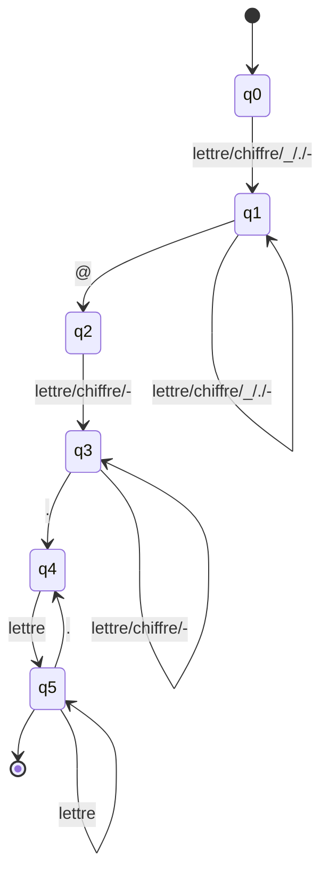

# Automate — EMAIL

Regex de départ (voir [`../regex.md`](../regex.md)) :

```
[a-zA-Z0-9_.-]+ @ [a-zA-Z0-9-]+ ("." [a-zA-Z]+)+
```

## Schéma



## États

| État | Rôle |
|---|---|
| q0 | Initial |
| q1 | En train de lire la partie locale (avant le `@`) |
| q2 | Vient de lire le `@`, attend le premier caractère du domaine |
| q3 | En train de lire le nom de domaine |
| q4 | Vient de lire un `.`, attend la première lettre de l'extension |
| q5 | En train de lire l'extension — **état final** |

## Transitions

| Depuis | Sur | Vers |
|---|---|---|
| q0 | `[a-zA-Z0-9_.-]` | q1 |
| q1 | `[a-zA-Z0-9_.-]` | q1 |
| q1 | `@` | q2 |
| q2 | `[a-zA-Z0-9-]` | q3 |
| q3 | `[a-zA-Z0-9-]` | q3 |
| q3 | `.` | q4 |
| q4 | `[a-zA-Z]` | q5 |
| q5 | `[a-zA-Z]` | q5 |
| q5 | `.` | q4 |

## État final

- **q5** uniquement. C'est important : q4 n'est pas final, donc si le mot s'arrête
  juste après un `.` (ex : `amadou@gmail.`), l'automate n'est jamais dans un état
  d'acceptation et EMAIL ne matche pas du tout sur cette portion.

## Remarque

La boucle `q5 → q4 → q5` permet de reconnaître plusieurs extensions à la suite
(`.univ-dakar.sn`, `.co.uk`...). Mais rien dans l'automate ne limite le nombre de
fois qu'on peut boucler, ni la longueur du bloc de lettres en q5. C'est exactement
ce qui explique, au niveau automate, le bug que Ibrahim documente en Partie 5 : sur
`amadou.diallo@gmail.comMerci`, l'automate reste en q5 tant qu'il voit des lettres,
donc il continue dans "Merci" sans distinction possible avec l'extension "com".
