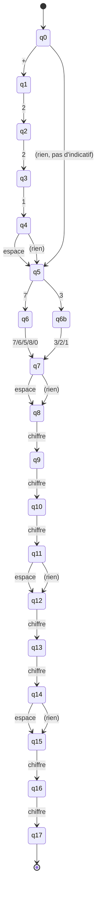

# Automate — TELEPHONE

Regex de départ (voir [`../regex.md`](../regex.md)) :

```
(+221 ?)? (77|76|75|78|70|33|32|31) ?[0-9]{3} ?[0-9]{2} ?[0-9]{2}
```

C'est le plus gros des 3 automates parce qu'il faut représenter : l'indicatif
optionnel, les 8 préfixes opérateur possibles, et les 3 espaces optionnels entre les
groupes de chiffres. On a gardé un état par chiffre attendu (plutôt que d'essayer de
factoriser avec des compteurs) pour que le schéma reste un automate "classique",
lisible avec juste des états et des flèches.

## Schéma



## États

| État | Rôle |
|---|---|
| q0 | Initial |
| q1-q4 | Lecture de l'indicatif optionnel `+221` |
| q5 | Point d'entrée du préfixe opérateur (avec ou sans indicatif avant) |
| q6, q6b | Première moitié du préfixe lue (7 ou 3) |
| q7 | Préfixe opérateur complet (77, 76, 75, 78, 70, 33, 32 ou 31) |
| q8 | Prêt à lire le 1er groupe de 3 chiffres |
| q9, q10, q11 | Lecture des 3 chiffres du 1er groupe |
| q12 | Prêt à lire le 2e groupe de 2 chiffres |
| q13, q14 | Lecture des 2 chiffres du 2e groupe |
| q15 | Prêt à lire le 3e groupe de 2 chiffres |
| q16, q17 | Lecture des 2 chiffres du 3e groupe — **q17 est l'état final** |

## Transitions (résumé — les 3 "espace optionnel" fonctionnent toutes pareil)

| Depuis | Sur | Vers |
|---|---|---|
| q0 | `+` | q1 |
| q1 | `2` | q2 |
| q2 | `2` | q3 |
| q3 | `1` | q4 |
| q4 | espace ou rien | q5 |
| q0 | rien (pas d'indicatif) | q5 |
| q5 | `7` | q6 |
| q6 | `7`,`6`,`5`,`8`,`0` | q7 |
| q5 | `3` | q6b |
| q6b | `3`,`2`,`1` | q7 |
| q7 | espace ou rien | q8 |
| q8→q9→q10→q11 | chiffre (×3) | — |
| q11 | espace ou rien | q12 |
| q12→q13→q14 | chiffre (×2) | — |
| q14 | espace ou rien | q15 |
| q15→q16→q17 | chiffre (×2) | — |

## État final

**q17** uniquement — atteint après avoir lu exactement 2+3+2+2 = 9 chiffres
(en comptant le préfixe), peu importe si les espaces optionnels étaient présents ou
non.

## Remarque

Les branches "espace ou rien" (q4→q5, q7→q8, q11→q12, q14→q15) sont en réalité deux
flèches distinctes vers le même état — techniquement ça fait de cet automate un NFA
(automate non-déterministe) plutôt qu'un DFA strict, mais ça reste beaucoup plus lisible
que de dupliquer tous les états qui suivent juste pour gérer 3 espaces indépendamment
optionnels. On assume cette simplification.
